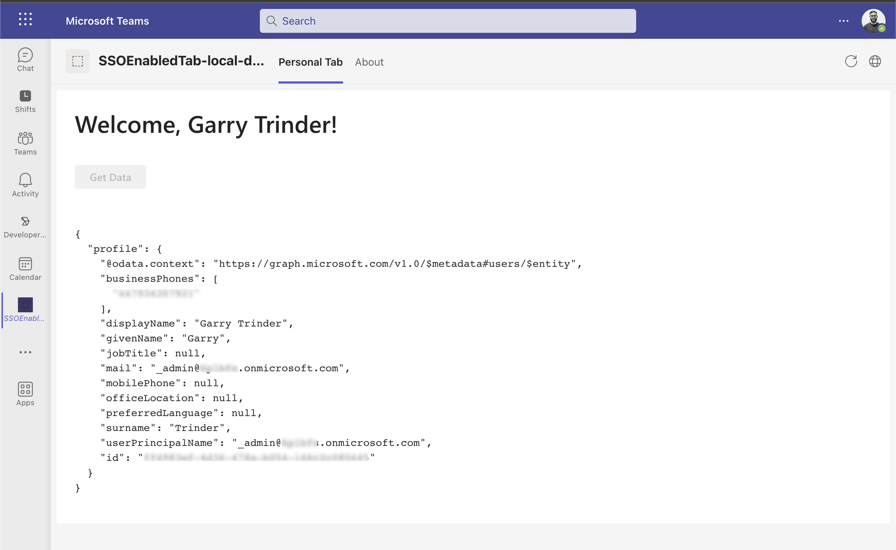

# Barebones SSO Enabled Tab project for Microsoft Teams Toolkit for Visual Studio Code

This project serves as a base for creating a Microsoft Teams app with the basic minimum implementation that you would require when building out a solution that contains a Tab enabled with single sign-on.

## Updates

The following list describes the updates made to the SSO-enabled tab project scaffolded by Microsoft Teams Toolkit for Visual Studio Code.

- Converted class based components to functional components
- Implemented native loading indicator
- Implemented Fluent UI 9
- ESLint and recommend plugins implemented
- Simplified folder structure
- Removed unused Tabs
  - Privacy
  - Terms of Use
- Removed sample components
- Removed packages
  - Northstar
  - Microsoft Graph Toolkit, use `npm i @microsoft/mgt-element @microsoft/mgt-react @microsoft/mgt-teamsfx-provider` to re-install
